# DM-Editable Rules-Based Combat System - Implementation Plan

**Goal:** Build a flexible, DM-customizable combat system with dice rolling, state tracking, and AI integration.

**Scope:** Backend + API + Basic UI (no fancy combat visualizations yet)

---

## Architecture Overview

```mermaid
graph TB
    subgraph DM_Config [DM Configuration]
        CombatRules[Combat Rules<br/>DM editable]
        DiceFormulas[Dice Formulas<br/>e.g., 1d20+5]
        CombatSettings[Combat Settings<br/>Turn order, etc.]
    end
    
    subgraph Combat_Engine [Combat Engine]
        DiceRoller[Dice Roller<br/>Parse & execute]
        StateManager[Combat State<br/>HP, initiative, etc.]
        RulesInterpreter[Rules Interpreter<br/>Apply DM rules]
    end
    
    subgraph Integration [Integration Layer]
        AI[AI DM<br/>Narrative]
        SpatialSystem[Spatial System<br/>Distance, LOS]
        Characters[Character Stats<br/>STR, DEX, etc.]
    end
    
    DM_Config --> Combat_Engine
    Combat_Engine --> Integration
    Integration --> AI
    
    style DM_Config fill:#4a1a5a
    style Combat_Engine fill:#1a4a5a
    style Integration fill:#2d5016
```



---

## Phase 1: Dice Rolling Engine 🎲

**Goal:** Parse and execute dice notation (1d20+5, 3d6, etc.)

### 1.1 Dice Parser Service
**File:** `services/dice-roller.ts`

**Features:**
- Parse standard dice notation: `XdY+Z` (e.g., `1d20+5`, `2d6-1`)
- Support multiple dice: `2d8+1d6+3`
- Support advantage/disadvantage: `1d20 adv` or `2d20kh1`
- Support dice modifiers: `3d6kh2` (keep highest 2)
- Result format: total + breakdown

**Example API:**
```typescript
interface DiceRollResult {
  total: number
  formula: string
  breakdown: string  // "d20: 15, +5 modifier = 20"
  rolls: number[]    // [15]
  modifiers: number  // 5
}

roll("1d20+5") → { total: 20, breakdown: "d20: 15, +5 = 20", ... }
roll("2d6+3") → { total: 11, breakdown: "d6: [4, 4], +3 = 11", ... }
```

### 1.2 Database Schema
**File:** `prisma/schema.prisma`

```prisma
model DiceRollLog {
  id          String   @id @default(cuid())
  sessionId   String
  characterId String?
  rollType    String   // "attack", "damage", "skill_check", etc.
  formula     String   // "1d20+5"
  result      Int
  breakdown   Json     // Detailed roll info
  triggeredBy String?  // "AI", "Player", "System"
  createdAt   DateTime @default(now())
  
  session     Session   @relation(...)
  character   Character? @relation(...)
  
  @@index([sessionId])
  @@index([characterId])
}
```

### 1.3 Testing
**File:** `tests/unit/services/dice-roller.test.ts`

Test cases:
- ✅ Basic rolls: `1d20`, `2d6`
- ✅ With modifiers: `1d20+5`, `3d6-2`
- ✅ Multiple dice: `1d20+2d6+3`
- ✅ Advantage/disadvantage
- ✅ Edge cases: `0d6`, negative modifiers

---

## Phase 2: Combat State Manager 💥

**Goal:** Track ongoing combat: initiative, HP, conditions, turns

### 2.1 Combat Session Model
**File:** `prisma/schema.prisma`

```prisma
model CombatSession {
  id              String   @id @default(cuid())
  sessionId       String
  status          CombatStatus // ACTIVE, PAUSED, ENDED
  currentTurn     Int      @default(0)
  currentRound    Int      @default(1)
  initiativeOrder Json     // Array of combatant IDs in order
  createdAt       DateTime @default(now())
  updatedAt       DateTime @updatedAt
  endedAt         DateTime?
  
  session         Session      @relation(...)
  combatants      Combatant[]
  combatLog       CombatLogEntry[]
  
  @@index([sessionId])
  @@index([status])
}

enum CombatStatus {
  ACTIVE
  PAUSED
  ENDED
}

model Combatant {
  id              String   @id @default(cuid())
  combatSessionId String
  characterId     String?  // Null for NPCs
  name            String
  initiative      Int
  currentHP       Int
  maxHP           Int
  tempHP          Int      @default(0)
  armorClass      Int      @default(10)
  conditions      Json     // Array: ["stunned", "prone", etc.]
  isPlayer        Boolean  @default(false)
  isActive        Boolean  @default(true) // false if dead/fled
  notes           String?
  
  combatSession   CombatSession @relation(...)
  character       Character?    @relation(...)
  
  @@index([combatSessionId])
  @@index([characterId])
}

model CombatLogEntry {
  id              String   @id @default(cuid())
  combatSessionId String
  round           Int
  turn            Int
  combatantId     String?
  action          String   // "attack", "damage", "heal", "condition", etc.
  description     String
  diceRollId      String?
  createdAt       DateTime @default(now())
  
  combatSession   CombatSession @relation(...)
  diceRoll        DiceRollLog?  @relation(...)
  
  @@index([combatSessionId])
  @@index([createdAt])
}
```

### 2.2 Combat Manager Service
**File:** `services/combat-manager.ts`

**Core Functions:**
```typescript
class CombatManagerService {
  // Start combat
  async startCombat(sessionId: string, combatants: CombatantInput[]): Promise<CombatSession>
  
  // Roll initiative for all combatants
  async rollInitiative(combatSessionId: string): Promise<void>
  
  // Get current combatant
  async getCurrentCombatant(combatSessionId: string): Promise<Combatant>
  
  // Advance to next turn
  async nextTurn(combatSessionId: string): Promise<void>
  
  // Apply damage/healing
  async applyDamage(combatantId: string, amount: number): Promise<Combatant>
  async applyHealing(combatantId: string, amount: number): Promise<Combatant>
  
  // Conditions
  async addCondition(combatantId: string, condition: string): Promise<void>
  async removeCondition(combatantId: string, condition: string): Promise<void>
  
  // End combat
  async endCombat(combatSessionId: string): Promise<void>
  
  // Get combat state summary
  async getCombatState(combatSessionId: string): Promise<CombatStateSummary>
}
```

---

## Phase 3: DM-Editable Combat Rules 📜

**Goal:** Let DMs define custom combat rules (not hardcoded D&D 5e)

### 3.1 Combat Rules Schema
**File:** `prisma/schema.prisma`

```prisma
model CombatRuleSet {
  id          String   @id @default(cuid())
  campaignId  String
  name        String   // "D&D 5e", "Pathfinder", "Homebrew"
  description String?
  isDefault   Boolean  @default(false)
  
  // Core mechanics
  attackFormula     String  @default("1d20")  // Base attack roll
  criticalThreshold Int     @default(20)      // Natural 20 = crit
  criticalMultiplier Int    @default(2)       // 2x damage
  
  // Initiative
  initiativeFormula String  @default("1d20+DEX")
  
  // Healing
  healingFormula    String  @default("1d8+WIS")
  
  // Custom rules (JSON for flexibility)
  advantageRules    Json?   // When to apply advantage
  conditionRules    Json?   // Effects of conditions
  actionEconomy     Json?   // Actions per turn
  customMechanics   Json?   // DM-defined mechanics
  
  createdAt   DateTime @default(now())
  updatedAt   DateTime @updatedAt
  
  campaign    Campaign @relation(...)
  
  @@index([campaignId])
}

model AttackAction {
  id              String   @id @default(cuid())
  combatRuleSetId String
  characterId     String?  // Null = applies to all
  name            String   // "Longsword Attack", "Fireball"
  attackType      AttackType
  attackFormula   String   // "1d20+STR+PROF"
  damageFormula   String   // "1d8+STR"
  damageType      String?  // "slashing", "fire", etc.
  range           Int?     // In meters
  description     String?
  
  combatRuleSet   CombatRuleSet @relation(...)
  character       Character?    @relation(...)
  
  @@index([combatRuleSetId])
  @@index([characterId])
}

enum AttackType {
  MELEE
  RANGED
  SPELL
  SPECIAL
}
```

### 3.2 Rules Interpreter Service
**File:** `services/rules-interpreter.ts`

**Features:**
- Parse formulas with character stat substitution
- Example: `"1d20+STR+PROF"` → `"1d20+3+2"` → rolls
- Apply advantage/disadvantage rules
- Calculate critical hits
- Resolve conditions (stunned = can't act, etc.)

```typescript
class RulesInterpreterService {
  // Resolve attack
  async resolveAttack(
    attackerId: string,
    targetId: string,
    attackActionId: string,
    combatSessionId: string
  ): Promise<AttackResult>
  
  // Apply custom rule
  async applyCustomRule(
    ruleId: string,
    context: CombatContext
  ): Promise<RuleResult>
  
  // Check if action is valid
  async validateAction(
    combatantId: string,
    actionType: string,
    combatSessionId: string
  ): Promise<boolean>
}

interface AttackResult {
  hit: boolean
  isCritical: boolean
  damage: number
  attackRoll: DiceRollResult
  damageRoll: DiceRollResult
  effects: string[]  // Applied conditions, etc.
  narrative: string  // AI-generated description
}
```

---

## Phase 4: Character Stats Integration ⚔️

**Goal:** Use existing Character.stats field in combat calculations

### 4.1 Update Character Model
**File:** `prisma/schema.prisma`

```prisma
model Character {
  // ... existing fields ...
  stats       Json?    // STR, DEX, CON, INT, WIS, CHA (already exists!)
  
  // Add combat-specific fields
  proficiencyBonus Int      @default(2)
  baseHP          Int      @default(10)
  hitDice         String   @default("1d8")  // "1d8", "1d10", etc.
  armorClass      Int      @default(10)
  speed           Float    @default(9.0)    // Already have baseMovementRate
  
  // Relations
  combatants      Combatant[]
  attackActions   AttackAction[]
}
```

### 4.2 Stat Calculation Service
**File:** `services/stat-calculator.ts`

```typescript
class StatCalculatorService {
  // Calculate modifier from ability score
  getModifier(abilityScore: number): number  // (score - 10) / 2
  
  // Get specific stat with modifier
  getStatValue(characterId: string, stat: 'STR' | 'DEX' | ...): Promise<{score: number, modifier: number}>
  
  // Calculate derived values
  calculateInitiativeBonus(characterId: string): Promise<number>
  calculateAttackBonus(characterId: string, attackType: AttackType): Promise<number>
  calculateArmorClass(characterId: string): Promise<number>
}
```

---

## Phase 5: AI Integration 🤖

**Goal:** AI narrates combat outcomes based on dice rolls and rules

### 5.1 Combat Context Builder
**File:** `services/context-builder.ts` (extend existing)

```typescript
interface CombatAIContext {
  combatSession: CombatSession
  currentCombatant: Combatant
  recentActions: CombatLogEntry[]  // Last 3-5 actions
  combatRules: CombatRuleSet
  spatialContext: SpatialAIContext  // Already exists!
}

// Add to existing buildContext method
async buildCombatContext(sessionId: string): Promise<CombatAIContext>
```

### 5.2 Enhanced AI Prompt
**File:** `lib/openai.ts` (extend)

Add to system prompt when combat is active:
```
COMBAT MODE ACTIVE
Current Round: {round}, Turn: {combatant.name}
HP: {currentHP}/{maxHP}, AC: {armorClass}
Available Actions: {actions}

Recent Combat Log:
- {recent actions with dice results}

When player declares an action:
1. I will roll the appropriate dice
2. Narrate the outcome dramatically
3. Apply mechanical effects (damage, conditions)
```

---

## Phase 6: API Endpoints 🔌

### 6.1 Combat Management APIs

```typescript
// Start/manage combat
POST   /api/sessions/[id]/combat/start
POST   /api/sessions/[id]/combat/[combatId]/initiative
POST   /api/sessions/[id]/combat/[combatId]/next-turn
POST   /api/sessions/[id]/combat/[combatId]/end
GET    /api/sessions/[id]/combat/[combatId]

// Combat actions
POST   /api/sessions/[id]/combat/[combatId]/attack
POST   /api/sessions/[id]/combat/[combatId]/damage
POST   /api/sessions/[id]/combat/[combatId]/heal
POST   /api/sessions/[id]/combat/[combatId]/condition

// Dice rolling (standalone)
POST   /api/dice/roll

// Combat rules (DM editing)
GET    /api/campaigns/[id]/combat-rules
POST   /api/campaigns/[id]/combat-rules
PATCH  /api/campaigns/[id]/combat-rules/[ruleId]
DELETE /api/campaigns/[id]/combat-rules/[ruleId]

// Attack actions (DM editing)
GET    /api/campaigns/[id]/attack-actions
POST   /api/campaigns/[id]/attack-actions
PATCH  /api/campaigns/[id]/attack-actions/[actionId]
DELETE /api/campaigns/[id]/attack-actions/[actionId]
```

---

## Phase 7: Basic UI Components 🎨

**Goal:** Simple, functional UI (not fancy animations yet)

### 7.1 Combat Tracker Component
**File:** `components/CombatTracker.tsx`

**Features:**
- Initiative order list
- Current turn indicator
- HP bars for each combatant
- Conditions displayed
- "Next Turn" button
- "End Combat" button

### 7.2 Combat Rules Editor
**File:** `components/CombatRulesEditor.tsx`

**Features:**
- Edit attack/damage formulas
- Set critical hit rules
- Define custom conditions
- Test dice rolls

### 7.3 Attack Action Editor
**File:** `components/AttackActionEditor.tsx`

**Features:**
- Create weapon/spell attacks
- Set formulas with stat macros (STR, DEX, etc.)
- Define damage type and range
- Assign to characters

### 7.4 Dice Roller Widget
**File:** `components/DiceRollerWidget.tsx`

**Features:**
- Manual dice roll input
- Quick buttons (d20, d6, d8, d10, d12)
- Show roll history
- Copy results

---

## Implementation Order

### Sprint 1: Foundation (Week 1)
**Estimated: 6-8 hours**

1. ✅ Dice rolling engine + tests
2. ✅ Database schema (Phase 1, 2, 3)
3. ✅ Run migrations
4. ✅ Dice roller API endpoint
5. ✅ Test dice rolling thoroughly

**Deliverable:** Working dice roller

---

### Sprint 2: Combat State (Week 2)
**Estimated: 8-10 hours**

1. ✅ Combat manager service
2. ✅ Combat APIs (start, initiative, turns, end)
3. ✅ HP/damage tracking
4. ✅ Condition system
5. ✅ Combat log

**Deliverable:** Can start/manage combat via API

---

### Sprint 3: Rules Engine (Week 3)
**Estimated: 8-10 hours**

1. ✅ Combat rule set model & APIs
2. ✅ Rules interpreter service
3. ✅ Stat calculator service
4. ✅ Attack resolution system
5. ✅ Default D&D 5e-style rules template

**Deliverable:** DM can define & execute custom rules

---

### Sprint 4: Character Integration (Week 4)
**Estimated: 4-6 hours**

1. ✅ Update character model
2. ✅ Attack actions per character
3. ✅ Stat-based calculations
4. ✅ Character sheet updates

**Deliverable:** Characters work in combat

---

### Sprint 5: AI Integration (Week 5)
**Estimated: 6-8 hours**

1. ✅ Combat context builder
2. ✅ Enhanced AI prompts for combat
3. ✅ Narrative generation from dice results
4. ✅ Integration testing

**Deliverable:** AI narrates combat beautifully

---

### Sprint 6: Basic UI (Week 6)
**Estimated: 10-12 hours**

1. ✅ Combat tracker component
2. ✅ Dice roller widget
3. ✅ Combat rules editor
4. ✅ Attack action editor
5. ✅ Integration into session page

**Deliverable:** Usable combat UI

---

## Total Estimated Effort

**Backend:** 28-34 hours  
**UI:** 10-12 hours  
**Total:** 38-46 hours

**Suggested pace:** 2-3 weeks working 15-20 hours/week

---

## Testing Strategy

### Unit Tests
- Dice roller (all formulas)
- Stat calculator
- Rules interpreter
- Combat manager logic

### Integration Tests
- Full combat flow (start → turns → end)
- Attack resolution
- HP tracking
- AI integration

### Manual Testing Checklist
- [ ] Start combat with 2+ combatants
- [ ] Roll initiative
- [ ] Execute attack (hit & miss)
- [ ] Apply damage and healing
- [ ] Add/remove conditions
- [ ] Critical hits work
- [ ] End combat
- [ ] AI narrates correctly
- [ ] DM can edit rules
- [ ] DM can create custom attacks

---

## Success Criteria

✅ DM can start combat with any number of combatants  
✅ System rolls initiative automatically  
✅ Turn order managed correctly  
✅ Dice rolling works for all D&D dice  
✅ HP tracking accurate (current, max, temp)  
✅ Conditions apply and track  
✅ DM can define custom combat rules  
✅ DM can create custom attacks per character  
✅ Character stats integrate with formulas  
✅ AI narrates combat outcomes  
✅ Spatial system integrated (range, LOS)  
✅ Combat log tracks all actions  

---

## Future Enhancements (Not in Scope)

- Advanced UI (drag-and-drop initiatives, animated HP bars)
- Spell slot tracking
- Inventory management in combat
- Area of effect calculations
- Automated pathfinding in combat
- Virtual tabletop map integration
- Sound effects / music
- Mobile app

---

## Design Decisions ✅

1. **Which RPG system as default?** ✅ Generic (basic system, expandable later)
2. **How much automation?** ✅ Player confirms actions (semi-automated)
3. **NPC management?** ✅ Pre-defined NPCs
4. **Critical failures?** ✅ Not implemented initially (can add later)
5. **Death/unconsciousness?** ✅ Auto-track

---

## Next Steps

**Ready to start?** We'll implement this step-by-step:

1. **Sprint 1 first** - Get dice rolling working
2. **Test thoroughly** at each phase
3. **Iterate based on feedback**

Let me know when you want to begin!
